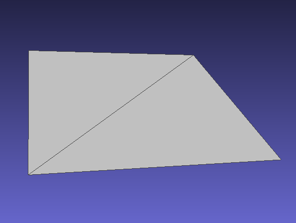
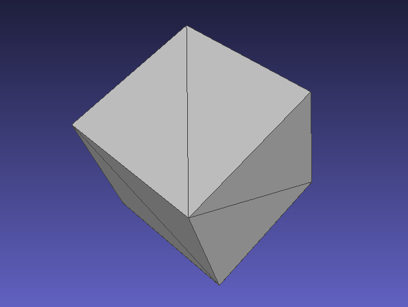
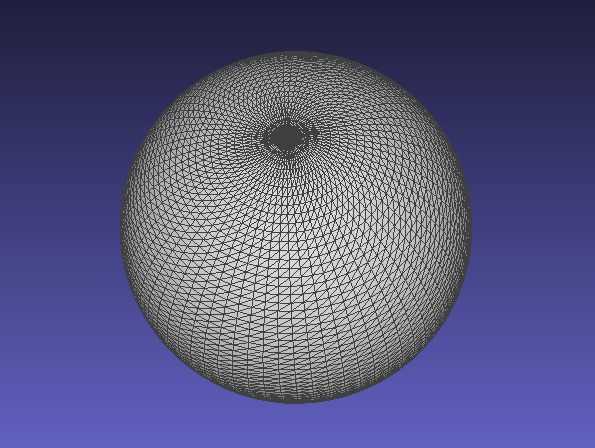
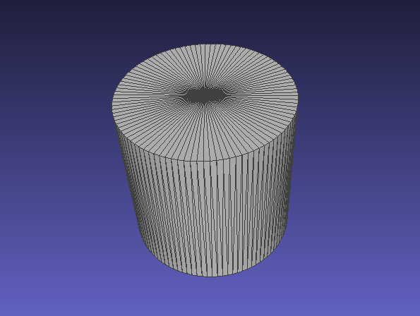

# Tools

There are some helpful command line tools that are compiled alongside the main library. After installation the tools are globally available to be called.

## rmagine_version

Prints the rmagine version. Should match the CMakeLists version.

```console
user@pc:~/rmagine/build$ ./bin/rmagine_version
2.2.1
```

## rmagine_benchmark

For every implemented computing device we compile a benchmark executable that simulates a Velodyne LiDAR sensor in a given mesh and prints out some useful run time statisitics.
Thus, we can compare the run times of different implementations on several computers.
The CPU / Embree version can be tested like this:

```console
user@pc:~/rmagine/build$ ./bin/rmagine_benchmark_cpu ../dat/sphere.ply
Rmagine Benchmark CPU (Embree)
Inputs: 
- mesh: ../dat/sphere.ply
Unit: 1 Velodyne scan (velo) = 14400 Rays
- range of last ray: 0.998762
-- Starting Benchmark --
[ 129% - 2215.605926 velos/s, mean: 2387.607002 velos/s] 
Result: 2387.607002 velos/s
```

Analogously, the GPU benchmark can be started as follows:

```console
user@pc:~/rmagine/build$ ./bin/rmagine_benchmark_gpu ../dat/sphere.ply
[RMagine - CudaContext] CUDA Driver Version / Runtime Version: 12.2.0 / 12.2.0
[RMagine - CudaContext] Construct context on device 0 - NVIDIA GeForce RTX 2060 
[RMagine - OptixContext] Init Optix (7.3.0). Required GPU driver >= 465.84
Rmagine Benchmark GPU (OptiX)
Inputs: 
- mesh: ../dat/sphere.ply
Unit: 1 Velodyne scan (velo) = 14400 Rays
Last Ray:
- range: 0.998762
-- Starting Benchmark --
[ 100% - 231941.938409 velos/s, mean: 231987.481164 velos/s] 
Result: 231987.481164 velos/s
```

## rmagine_map_info

Prints useful information about the contents of a mesh file. Internally it is just printing the meta information of the assimp buffers.

```console
user@pc:~/rmagine/build$ ./bin/rmagine_map_info ../dat/two_cubes.dae
Rmagine Map Info
Inputs: 
- filename: ../dat/two_cubes.dae
Meshes: 2
  Mesh 0
    - name: Cube_001-mesh
    - vertices, faces: 36, 12
    - primitives: TRIANGLE
    - normals: yes
    - vertex color channels: 0
    - uv channels: 1
    - bones: 0
    - material index: 1
    - tangents and bitangents: no
    - aabb: AABB [v[0,0,0] - v[0,0,0]]
  Mesh 1
    - name: Cube-mesh
    - vertices, faces: 36, 12
    - primitives: TRIANGLE
    - normals: yes
    - vertex color channels: 0
    - uv channels: 1
    - bones: 0
    - material index: 0
    - tangents and bitangents: no
    - aabb: AABB [v[0,0,0] - v[0,0,0]]
Textures: 0
Scene Graph: 
- name: Scene
- transform: 
  M4x4[
    1 0 0 0
    0 1 0 0
    0 0 1 0
    0 0 0 1
  ]
- meshes: 0
- children: 4
  Node 0
    - name: Cube_001
    - transform: 
      M4x4[
        1 0 0 5.01877
        0 1 0 3.78582
        0 0 1 1.01026
        0 0 0 1
      ]
    - meshes: 1
      - mesh ref 0 -> 0
    - children: 0
  Node 1
    - name: Camera
    - transform: 
      M4x4[
        0.685921 -0.324014 0.651558 7.35889
        0.727676 0.305421 -0.61417 -6.92579
        0 0.895396 0.445271 4.95831
        0 0 0 1
      ]
    - meshes: 0
    - children: 0
  Node 2
    - name: Light
    - transform: 
      M4x4[
        -0.290865 -0.771101 0.566393 4.07624
        0.955171 -0.199883 0.218391 1.00545
        -0.0551891 0.604525 0.794672 5.90386
        0 0 0 1
      ]
    - meshes: 0
    - children: 0
  Node 3
    - name: Cube
    - transform: 
      M4x4[
        1.64731 1.34142 -0.299005 5.7392
        -1.28721 1.34237 -1.06938 -4.66034
        -0.481559 1.00054 1.83561 1.69496
        0 0 0 1
      ]
    - meshes: 1
      - mesh ref 0 -> 1
    - children: 0
```

## rmagine_synthetic

Generate different meshes for quick testing. Show the possible options by entering

```console
user@pc:~/rmagine/build$ ./bin/rmagine_synthetic
Rmagine Synthetic
Usage: ./bin/rmagine_synthetic mesh_type mesh_file
- mesh_type: plane | cube | sphere | cylinder 
```


| | |
|:----:|:----:|
|   |   |
| `rmagine_synthetic plane plane.ply` | `rmagine_synthetic cube cube.ply` |
|   |   |
| `rmagine_synthetic sphere sphere.ply` | `rmagine_synthetic cylinder cylinder.ply` |