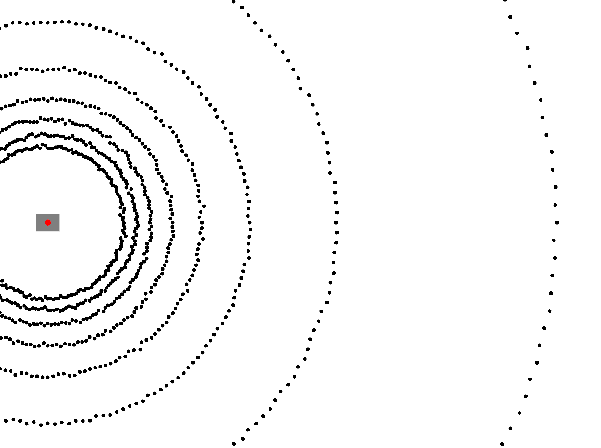
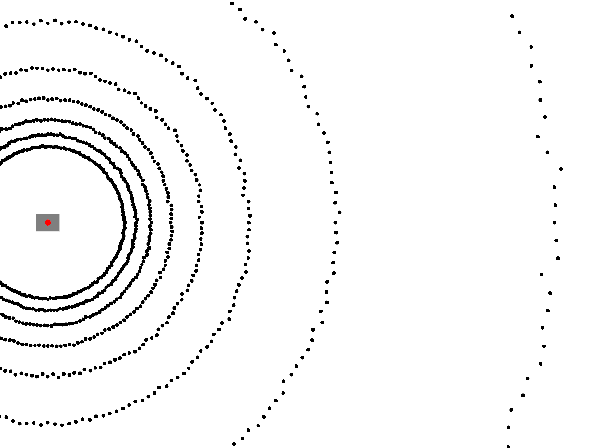
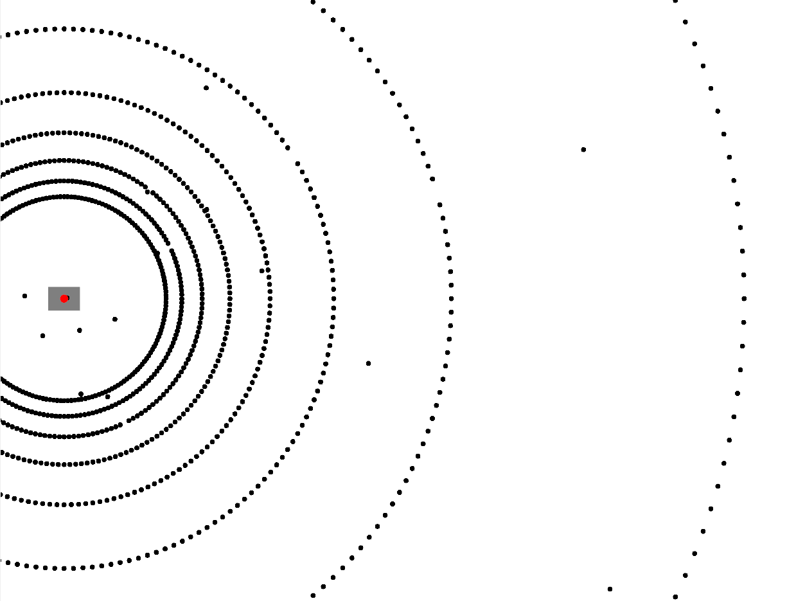

Currently noise models are implemented as postprocessing steps that modify the simulated ranges. Any of the following noise models can be chained to generate complex combined noise models.
The Noise models are implented equally both on GPU and CPU.
Thus the developer can manage to apply noise to the data without downloading or uploading the data from GPU to CPU or vice versa.


1. Gaussian Noise

Apply gaussian noise $N(\mu, \sigma)$ to simulated ranges.

| Parameter |  Description  |
|:---------:|:-------------:|
| `mean` | Mean $\mu$ of normal distributed noise |
| `stddev` | standard deviation $\sigma$ of normal distributed noise |





Example CPU:

```cpp
#include <rmagine/noise/GaussianNoise.hpp>
namespace rm = rmagine;

// what happend before:
// - data was simulated and stored into variable 'res'

// make a copy to keep the unnoised ranges
rm::Memory<float, rm::RAM> ranges = res.ranges;

// Base class: Noise
float mean = 0.0;
float stddev = 1.0;
rm::NoisePtr noise = std::make_shared<rm::GaussianNoise>(
    mean, stddev);

// apply noise
noise->apply(ranges);
// ranges now contains noise
```

Example CUDA:

```cpp
#include <rmagine/noise/GaussianNoiseCuda.hpp>
namespace rm = rmagine;

// what happend before:
// - data was simulated and stored into variable 'res'


// make a copy to keep unnoised ranges
rm::Memory<float, rm::VRAM_CUDA> ranges = res.ranges;

// Base class: NoiseCuda
float mean = 0.0;
float stddev = 1.0;
rm::NoiseCudaPtr noise = std::make_shared<rm::GaussianNoiseCuda>(
    mean, stddev);

// apply noise
noise->apply(ranges);
// ranges now contains noise
```

2. Relative Gaussian Noise

Apply gaussian noise $N(\mu, \sigma_r)$ to simulated ranges. Here, the standard deviation varies depending on distance.


| Parameter |  Description  |
|:---------:|:-------------:|
| `mean` | Mean $\mu$ of normal distributed noise |
| `stddev` | standard deviation $\sigma$ of normal distributed noise |
| `range_exp` | range exponent $c$ to compute range based stddev: $ \sigma_r = \sigma \cdot r^{c} $ |



Example CPU:

```cpp
#include <rmagine/noise/RelGaussianNoise.hpp>
namespace rm = rmagine;

// what happend before:
// - data was simulated and stored into variable 'res'

// make a copy to keep the unnoised ranges
rm::Memory<float, rm::RAM> ranges = res.ranges;

// Base class: Noise
float mean = 0.0;
float stddev = 0.2;
float range_exp = 1.1;
rm::NoisePtr noise = std::make_shared<rm::RelGaussianNoise>(
    mean, stddev, range_exp);

// apply noise
noise->apply(ranges);
// ranges now contains noise
```

Example CUDA:

```cpp
#include <rmagine/noise/RelGaussianNoiseCuda.hpp>
namespace rm = rmagine;

// what happend before:
// - data was simulated and stored into variable 'res'


// make a copy to keep unnoised ranges
rm::Memory<float, rm::VRAM_CUDA> ranges = res.ranges;

// Base class: NoiseCuda
float mean = 0.0;
float stddev = 0.2;
float range_exp = 1.1;
rm::NoiseCudaPtr noise = std::make_shared<rm::RelGaussianNoiseCuda>(
    mean, stddev, range_exp);

// apply noise
noise->apply(ranges);
// ranges now contains noise
```

3. Uniform Dust Noise

Apply uniform dust noise to simulated ranges. Assuming some small particles could be hit by the range sensor that are not modeled by the scene, use this noise type. 

Parameters:

| Parameter |  Description  |
|:---------:|:-------------:|
| `hit_prob` | Probability of a ray hitting a particle in one meter free space. |
| `return_prob` | Probability of a ray hitting dust returns to sender depending on particle distance |





Example CPU:


```cpp
#include <rmagine/noise/UniformDustNoise.hpp>
namespace rm = rmagine;

// what happend before:
// - data was simulated and stored into variable 'res'

// make a copy to keep the unnoised ranges
rm::Memory<float, rm::RAM> ranges = res.ranges;

// Base class: Noise
float hit_prob = 0.0;
float ret_prob = 1.0;
rm::NoisePtr noise = std::make_shared<rm::UniformDustNoise>(
    hit_prob, ret_prob);

// apply noise
noise->apply(ranges);
// ranges now contains noise
```

Example CUDA:

```cpp
#include <rmagine/noise/UniformDustNoiseCuda.hpp>
namespace rm = rmagine;

// what happend before:
// - data was simulated and stored into variable 'res'


// make a copy to keep unnoised ranges
rm::Memory<float, rm::VRAM_CUDA> ranges = res.ranges;

// Base class: NoiseCuda
float hit_prob = 0.0;
float ret_prob = 1.0;
rm::NoiseCudaPtr noise = std::make_shared<rm::UniformDustNoiseCuda>(
    hit_prob, ret_prob);

// apply noise
noise->apply(ranges);
// ranges now contains noise
```