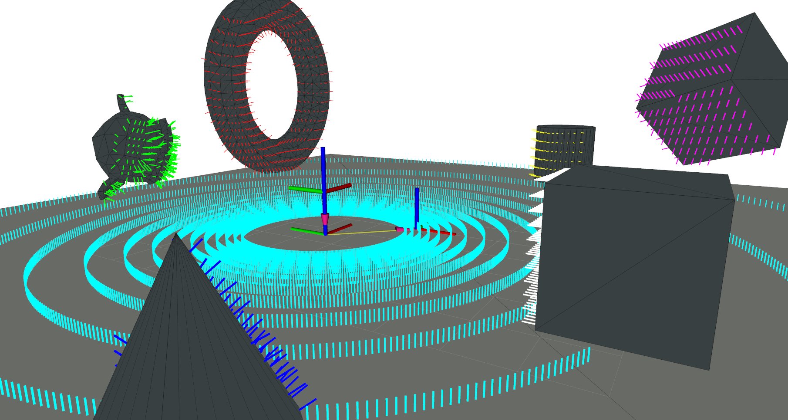

# Rmagine

[Rmagine](https://github.com/uos/rmagine) allows a robot to simulate sensor data for arbitrary range sensors directly on board via raytracing. Since robots typically only have limited computational resources, [Rmagine](https://github.com/uos/rmagine) aims at being flexible and lightweight, while scaling well even to large environment maps. It runs on several platforms like Laptops or embedded computing boards like Nvidia Jetson by putting an unified API over specific proprietary libraries provided by the hardware manufacturers. This work is designed to support the future development of robotic applications depending on simulation of range data that could previously not be computed in reasonable time on mobile systems.

## Design Goals

[Rmagine](https://github.com/uos/rmagine) is mainly designed for robotic applications:

- Perform multiple sensor simulations simultaneously and in realtime.
- Compute the same operations on different computing devices (CPU, GPU..).
- Hold data at device of computation to minimize copy overhead between devices.
- Maintain minimal graphical overhead (offscreen-rendering)
- Support runtime critical operations, e.g. Monte Carlo simulations

## Intersection Attributes

Rmagine supports to select certain attributes that shall be computed and returned at a ray-surface intersection.
The following image shows the simulating a spherical sensor model and selecting Cartesian points (`rm::Points`), surface normals (`rm::Normals`), object ids (`rm::ObjectIds`) as attributes.



The points and normals are represented by a fixed length line segment with the Cartesian point as origin the surface normal as direction, colored by the object id.

Read more details about this here: [Getting Started/Simulation](/getting_started/simulation.md).

## Citation

We presented this work at ICRA'23 in London. The paper gives valuable insights of the design concepts of this library.
When using the Rmagine library or any related ideas in your scientific work, please reference the following paper:

```bib
@inproceedings{mock2023rmagine,
  title={{Rmagine: 3D Range Sensor Simulation in Polygonal Maps via Ray Tracing for Embedded Hardware on Mobile Robots}}, 
  author={Mock, Alexander and Wiemann, Thomas and Hertzberg, Joachim},
  booktitle={IEEE International Conference on Robotics and Automation (ICRA)}, 
  year={2023},
  doi={10.1109/ICRA48891.2023.10161388}
}
```

## Table of Contents

This documentation cosists of several examples, guides and conceptual explanations to give users a more thourough understanding of [Rmagine](https://github.com/uos/rmagine).
As the name tells, new users should make themselfs familar with **Getting Started** first, before continuing to the more advanced examples.

**Rmagine**

- [Overview](/index.md)
- [Installation](/installation.md)
- [Integration](/integration.md)

**Getting Started**

- [Maps](/getting_started/maps.md)
- [Sensors](/getting_started/sensors.md)
- [Simulation](/getting_started/simulation.md)
- [Problem Modelling](/getting_started/problem_modelling.md)
- [Noise](/getting_started/noise.md)

**Library**

- [Concepts](/library/concepts.md)
- [Math](/library/math.md)
- [Memory](/library/memory.md)
- [Maps](/library/maps.md)

**Extra**

- [Tools](/extra/tools.md)
- [Data](/extra/data.md)
- [Embree 3](/extra/embree3.md)
- [CMake - Advanced](/extra/cmake_advanced.md)
- [Contributions](/extra/contributions.md)
- [News](/extra/news.md)

## Contributions

You are welcome to contribute to the docs of [Rmagine](https://github.com/uos/rmagine)! Thorough and clear documentation is essential. You can help us by correcting mistakes, improving content, or adding examples that facilitate user navigation and usage of the project. Please submit any documentation-related issues to the repository [rmagine_docs](https://github.com/uos/rmagine_docs). If you're making fixes or adding examples, don’t hesitate to submit a pull request afterward!

### PR workflow

How to contribute to this documentation via pull requests:

1. Fork the repository: [rmagine_docs](https://github.com/uos/rmagine_docs).
2. Make changes on your forked repository.
3. Check locally on your machine if mkdocs is able to compile your changes ([instructions](https://github.com/uos/rmagine_docs)).
4. Go to Github and click "Pull Request", select this repository's "main" branch as target.
5. If you added new content, please provide a brief explanation of why you believe it is beneficial for the documentation.
6. Send PR
